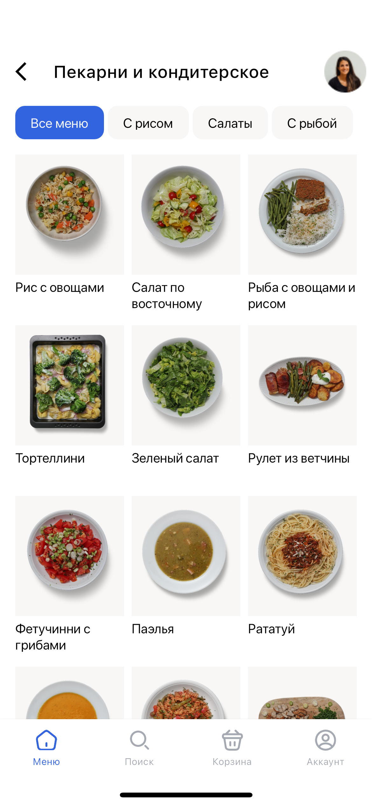

# Food supermarket

Mobile app

### Libs
- flutter_bloc
- retrofit
- dio
- json_serializable
- flutter_svg
- go_router

For generate code use command

`
dart run build_runner build
`

### Features

- Main page
- Category page
- Food page
- Cart page

### Screenshots

    <kbd>
        
    </kbd>
    <kbd>
        
    </kbd>
    <kbd>
        
    </kbd>
    <kbd>
        
    </kbd>

